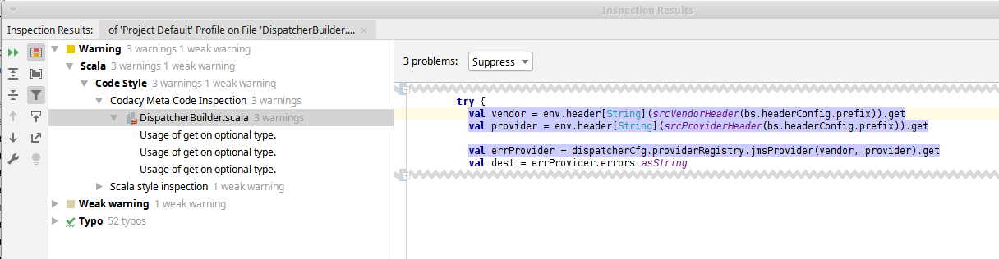

# Codacy Meta checks in IntelliJ

We are using https://codacy.com[codacy] to improve the code quality
of our project https://github.com/woq-blended/blended[Blended].
It works really well and provides lot of insights.

This having said, for Scala there are 2 main sources of issues when
using codacy out of the box: http://www.scalastyle.org/[ScalaStyle]
and https://github.com/codacy/codacy-scalameta[Codacy ScalaMeta Pro].

The Ide of our choice (IntelliJ) dsiplays the issues originating from
ScalaStyle just fine, but the issues originating from Codacy's ScalaMeta
where invisible to IntelliJ.

To better work on the code we made an attempt to implement the Codacy Scalameta
inspection as a plugin for IntelliJ, so that the issues are navigable in
IntelliJ and cleaning up is actually fun ;)

.DISCLAIMER
****
This is my first IntelliJ plugin and I may used the API not entirely
as intended. I have shamelessly looked at the Scalastyle inspection
implementation as an example, so you will find similarities.
For convenience the jar files produced by https://github.com/codacy/codacy-scalameta[Codacy ScalaMeta Pro]
are within here in the version I have tested. If those libraries are
released in the future to a central repo, those jars will vanish from here.
****

## Building

The plugin uses the https://github.com/JetBrains/sbt-idea-plugin[sbt-idea-plugin]
on top of sbt to build and package the plugin. You will need sbt 1.2.8 or greater
to build.

From within the checkout directory simply execute

....
sbt clean codacymetaIntellij/packagePluginZip
....

This will create a file

....
./codacy-meta-intellij/target/codacymetaIntellij-0.1.0-SNAPSHOT.zip
....

which contains the plugin that can be installed in IntelliJ as a normal
plugin (you will need to choose __Install plugin from disc__).

## Running the plugin in a dev instance of IntelliJ

From within the checkout directory, you can run

....
sbt clean codacymetaIntellij/run
....

This will download the IntelliJ community edition and the Scala Plugin
and will then start the downloaded version of IntelliJ with the Codacy
inspection plugin activated, so you can test it in isolation first.

## Configuring the plugin

The plugin expects a file `codacymeta.json` which lives either in the
project root directory, in the `project` directory or in the `.idea`
directory of the project.

This file contains all the inspections that are currently active within
IntelliJ. For reference you can find `codacymeta.json.complete` in this
projects to see, what checks might be enabled.

NOTE: For now the plugin does not evaluate the parameter section within
the JSON file to configure the executed patterns. This might be added on
as needed basis.

## Sample output

